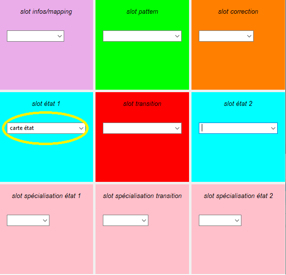

# Card Finite State Machine

This application uses **physical cards** to write **finite state machine** diagrams.

It embarks **State Machine Cat** as a statechart renderer.

It is delivered with a card board simulator running in python.

# Files

- Node 16.x
- Python 3.x

# Requirements

- Node 16.x
- Python 3.x

# Setup

Clone the repo and install the dependencies.

```bash
git clone https://github.com/TheMaskedMango/cardFSM.git
cd cardFSM
```

```bash
npm install
```


# Getting started

Start the server with

```bash
node app.js
```

And connect to the graphical interface via [localhost:3000](localhost:3000)

Start the board simulator in another terminal with

```bash
py .\pythonBoard\graphicalBoard.py
```

> The system currently works only using the board simulator.

# Creating Finite State Machines

## Creating states

The creation of elements is made with the 2 blue slots by choosing between initial, final and regular states.




## Editing elements

The edition is made through the graphical interface by clicking on the element and pressing the edit button.


## Creating transitions

### Mapping states

In order to create a transition between 2 states, you need to map them to a card by choosing a card on the mapping slot and clicking the state you want to map on the interface.


### Choosing transition

Once your states are mapped, you can activate them by laying the mapping cards on the states slots and choose the transition you want with the transition slot.


## Specify the elements

You can add *entry* and *exit* actions on **active** states as well as *guard* and *action* on transition with the bottom slots.

## Using patterns

It is possible to encapsulate your diagram in a *compound state* by choosing the card in the pattern slot. 


You can edit and map compound state as regular ones.